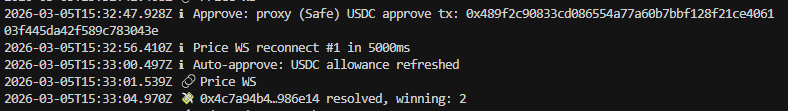

# Polymarket Win Bot

Lightweight trading bot for **Polymarket** “Up or Down” prediction markets (e.g. Bitcoin, Ethereum, Solana, XRP over 5m, 15m, or 1h). It buys once per market when price is in range, locks profit at a target price, and cuts loss automatically. No Redis or MongoDB — state and logs live in JSON/text files.

---

## 1. Main strategy: how you earn and how profit is locked

### How the bot earns

The bot trades **binary outcome tokens** (Up / Down) on Polymarket. It tries to:

1. **Buy low**  
   When the **winning side** (Up or Down) trades in a **price band** you set (e.g. between `BUY_TRIGGER_PRICE` and `MAX_BUY_PRICE`), the bot places **one buy per market** at that price.

2. **Sell high (profit lock)**  
   When the **bought token’s price** reaches your **profit target** (e.g. `PROFIT_LOCK_PRICE = 0.99`), the bot **sells immediately** at market to lock in gains.

3. **Cut losses**  
   If the bought token’s price **falls to or below** your **stop level** (e.g. `STOP_LOSS_PRICE`), the bot **sells all** immediately to limit downside.

So earnings come from:

- **Price move in your favor** → sell at profit lock (e.g. at 0.99).
- **Holding the correct outcome to resolution** → you can still redeem after resolution; the bot can **auto-redeem** winning positions and log redeems.

Example from a typical run:

- Bot buys **Down** when price is in `[0.9, 0.95]` (e.g. “Down price 0.900 in [0.9, 0.95], buying Down (once per market)”).
- Later: “profit lock 0.990 >= 0.99, selling Down” → sell 2.19 Down at ~0.96 (bid 0.98), locking profit.

### How profit is locked

- **Automatically by the bot**  
  When the **live price** of the token you bought reaches **`PROFIT_LOCK_PRICE`** (e.g. **0.99**), the bot sends a **market sell** (FAK) and logs it (e.g. “SELL Down profit_lock: 2.19 shares @ 0.960 (bid 0.980)”). That’s your profit lock.

- **On the Polymarket website**  
  You can also lock profit manually: open the market, find your position in **Positions**, and click **Sell** to close at the current market price.

- **FAK orders**  
  The bot uses **Fill-And-Kill (FAK)** orders: fill immediately or cancel. That gives fast entry/exit but requires enough liquidity on the book; if there’s no match you may see “no orders found to match with FAK order” and the bot will retry on the next cycle.

---

## 2. Bot features

- **One buy per market**  
  For each market (each time window), the bot buys **at most once** (either Up or Down when price is in range). It never re-buys the same market after that.

- **Price range for buying**  
  - Only buys when token price is **≥** `BUY_TRIGGER_PRICE` and **≤** `MAX_BUY_PRICE` (e.g. 0.9–0.95 so you don’t buy when price is over 0.95).

- **Profit lock**  
  Sells the position when the **bought token price ≥** `PROFIT_LOCK_PRICE` (e.g. 0.99).

- **Stop loss**  
  Sells the full position when the **bought token price ≤** `STOP_LOSS_PRICE`.

- **Multi-market by slug**  
  You choose **one slug** (e.g. `btc-updown-5m`, `eth-updown-15m`, `xrp-updown-1h`). The bot follows the **current** market for that slug; when that window ends it **automatically** moves to the **next** window (same slug, next 5m/15m/1h).

- **Lightweight**  
  No Redis/MongoDB. State: `src/data/win-bot-state.json`. Holdings: `src/data/token-holding.json`. Logs: `log/trades.log`, `log/market-prices.log`, `log/redeems.log`.

- **Auto redeem**  
  After a market resolves, the bot can redeem winning positions and log to `log/redeems.log`.

- **Auto approve**  
  Refreshes USDC allowance on Polygon every N minutes (e.g. 4 or 5) so orders don’t fail for allowance.

- **Credentials**  
  Uses `PRIVATE_KEY` to derive or create the Polymarket CLOB API key; no need to manually copy API key/passphrase/signature into `.env`. On 401/credential errors it refreshes and retries.

- **Buy price buffer**  
  Adds a small % above the reference price for buy orders so FAK is more likely to fill (configurable via `BUY_PRICE_BUFFER`).

---

## 3. Screenshots

**Polymarket UI** — market view, positions, history, and manual sell:


**Bot console** — buy (once per market), profit lock sell, WebSocket price updates:


**Auto redeem** — USDC approval, allowance refresh, market resolved and winning outcome:



---

## 4. Environment variables (detailed)

Put these in a **`.env`** file in the project root (copy from `.env.example`). Below: what each value is and **where to get it** so basic users can run the bot.

### Market selection

| Variable | What it is | Where to get it / how to set |
|----------|------------|------------------------------|
| **`POLYMARKET_SLUG_PREFIX`** | Which market (asset + timeframe). Examples: `btc-updown-5m`, `btc-updown-15m`, `btc-updown-1h`, `eth-updown-5m`, `sol-updown-15m`, `xrp-updown-1h`. | You **choose** this. Use the market’s slug: e.g. “Bitcoin Up or Down - 5 Minutes” → `btc-updown-5m`. See “How to switch other markets” below. |

### Buy / sell rules

| Variable | What it is | Where to get it / how to set |
|----------|------------|------------------------------|
| **`BUY_TRIGGER_PRICE`** | Minimum price (e.g. 0.9) for the bot to consider buying. Bot buys only when token price is **≥** this and **≤** `MAX_BUY_PRICE`. | You **choose** (e.g. `0.9`). |
| **`MAX_BUY_PRICE`** | Maximum price (e.g. 0.95) at which the bot will buy. Bot **does not buy** if price is above this. | You **choose** (e.g. `0.95`). |
| **`PROFIT_LOCK_PRICE`** | When the **bought token’s price** reaches this (e.g. 0.99), the bot sells to lock profit. | You **choose** (e.g. `0.99`). |
| **`STOP_LOSS_PRICE`** | When the **bought token’s price** is at or below this, the bot sells everything (stop loss). | You **choose** (e.g. `0.6`). |
| **`BUY_AMOUNT_USD`** | How much USD to spend per buy (e.g. 2 or 5). | You **choose** based on risk and balance. |
| **`BUY_PRICE_BUFFER`** | Extra % above reference price when placing the buy order so the FAK is more likely to fill (e.g. `0.03` = 3%). | Optional; default `0.03`. Increase slightly if you see “no orders found to match” often. |

### Credentials (required for trading)

| Variable | What it is | Where to get it |
|----------|------------|-----------------|
| **`PRIVATE_KEY`** | The **private key** of the wallet that holds USDC and will trade on Polymarket. | From your wallet (MetaMask: Account details → Export Private Key). **Never share or commit this.** The bot uses it to **derive** the Polymarket API key; you do **not** need to manually create an API key in the Polymarket UI. |
| **`PROXY_WALLET_ADDRESS`** | If you trade via a **Safe (multisig)** or proxy, this is that contract address. The bot signs with `PRIVATE_KEY` but orders are placed for this address. | From your Safe/app (e.g. Polymarket shows “maker” as this address). If you trade from the same wallet as `PRIVATE_KEY`, leave empty or set to that wallet’s address. |

You do **not** set `POLY_API_KEY`, `POLY_PASSPHRASE`, `POLY_SIGNATURE`, `POLY_TIMESTAMP`, or `POLY_NONCE` in `.env` — the bot derives/creates the API key and signs requests using `PRIVATE_KEY`.

### Optional / advanced

| Variable | What it is | Where to get it |
|----------|------------|-----------------|
| **`CLOB_API_URL`** | Polymarket CLOB API base URL. | Leave default: `https://clob.polymarket.com`. |
| **`CHAIN_ID`** | Polygon mainnet = 137. | Default `137`. |
| **`RPC_URL`** | Polygon RPC for approvals/redemptions. | Optional. You can use a public RPC or set e.g. Infura/Alchemy URL. |
| **`RPC_TOKEN`** | If your RPC provider needs a key (e.g. Alchemy). | From the provider’s dashboard. |
| **`ENABLE_WIN_BOT`** | Set to `false` to disable buying/selling (e.g. monitoring only). | Default `true`. |
| **`ENABLE_AUTO_REDEEM`** | Set to `false` to disable automatic redemption after resolution. | Default `true`. |
| **`APPROVE_INTERVAL_MINUTES`** | How often to refresh USDC allowance (minutes). | Default `5`. |
| **`POLL_INTERVAL_MS`** | How often the bot checks prices and logic (milliseconds). | Default `2000`. |

---

## 5. How to switch other markets

The bot trades **one slug** at a time. The slug identifies both the **asset** and the **timeframe** (5m, 15m, 1h).

### Supported slug patterns

- **Asset + timeframe:**  
  `btc-updown-5m`, `btc-updown-15m`, `btc-updown-1h`  
  `eth-updown-5m`, `eth-updown-15m`, `eth-updown-1h`  
  `sol-updown-5m`, `sol-updown-15m`, `sol-updown-1h`  
  `xrp-updown-5m`, `xrp-updown-15m`, `xrp-updown-1h`

### Steps to switch market

1. **Choose the market** on Polymarket (e.g. “Bitcoin Up or Down - 5 Minutes” or “Ethereum Up or Down - 15 Minutes”).
2. **Set the slug** in `.env`:  
   `POLYMARKET_SLUG_PREFIX=btc-updown-5m`  
   or  
   `POLYMARKET_SLUG_PREFIX=eth-updown-15m`  
   etc. The suffix (`-5m`, `-15m`, `-1h`) sets the window length; the bot auto-switches to the next window when the current one ends.
3. **Restart the bot** so it loads the new slug.

You do **not** need to look up `tokenId`s or market IDs — only the **slug** (e.g. `btc-updown-5m`) in `POLYMARKET_SLUG_PREFIX`.

---

## 6. Setup and run

```bash
# Install
npm install

# Build
npm run build

# Run (production)
npm run dev

# Or run with ts-node (development)
npm start
```

**First time:**

1. Copy `.env.example` to `.env`.
2. Set `PRIVATE_KEY` (and `PROXY_WALLET_ADDRESS` if you use a proxy).
3. Set `POLYMARKET_SLUG_PREFIX` (e.g. `btc-updown-5m`).
4. Set `BUY_TRIGGER_PRICE`, `MAX_BUY_PRICE`, `PROFIT_LOCK_PRICE`, `STOP_LOSS_PRICE`, `BUY_AMOUNT_USD` to your strategy.
5. Run the bot; it will create the API credential and start trading when price is in range.

---

## 7. Files and logs

| Path | Purpose |
|------|---------|
| `src/data/win-bot-state.json` | Bot state: enabled, positions, last market, bought markets. |
| `src/data/token-holding.json` | Current token holdings per market. |
| `src/data/credential.json` | Polymarket API credential (created by bot from `PRIVATE_KEY`). |
| `log/trades.log` | Every buy/sell with details. |
| `log/market-prices.log` | Realtime prices from WebSocket (throttled). |
| `log/redeems.log` | Redemption events. |

---

## 8. Quick reference: strategy and profit lock

- **Earn:** Buy when Up or Down is in your price band (e.g. [0.9, 0.95]), once per market; sell when price hits profit lock (e.g. 0.99) or exit at stop loss.
- **Lock profit:** Bot automatically sells when bought token price ≥ `PROFIT_LOCK_PRICE`; you can also sell manually on Polymarket.
- **Switch markets:** Change `POLYMARKET_SLUG_PREFIX` in `.env` (e.g. to `eth-updown-15m`) and restart the bot.
